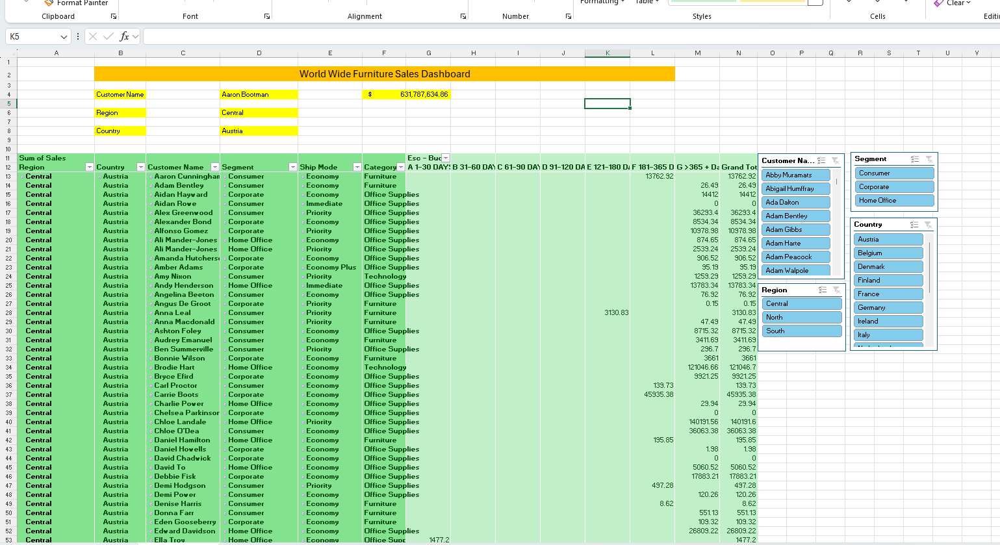

# Worldwide Furniture Sales Analysis

## Project Overview

This project analyzes Worldwide Furniture sales data using Microsoft Excel.

The objective is to evaluate sales performance, profitability, customer contribution, product performance, and regional trends through an interactive Excel dashboard.

## Business Questions

This analysis focuses on the following questions:

1. What are the total sales, cost, and profit?
2. Which regions generate the highest sales?
3. Which countries contribute the most revenue?
4. Which product categories perform best?
5. Which customers and products contribute the most sales?
6. How does sales performance vary over time?

## Dataset

The dataset contains Worldwide Furniture sales transactions covering the period from 2017 to 2020.

Key fields include:

- Order Date
- Shipping Date
- Region
- Country
- Category
- Product Name
- Customer Name
- Sales
- Cost
- Profit
- Invoice details

## Tools Used

- Microsoft Excel
- Pivot Tables
- Pivot Charts
- Slicers
- Excel Formulas
- Interactive Dashboard

## Dashboard

The Excel dashboard provides an interactive view of key business metrics and allows users to filter the analysis by different dimensions.

### Key Metrics

- Total Sales: 631.79M
- Total Cost: 473.84M
- Total Profit: 157.95M
- Total Invoices: 7,476

### Dashboard Analysis

The dashboard includes analysis of:

- Sales by Region
- Sales by Country
- Product Performance
- Customer Performance
- Category Performance
- Sales Trends by Year and Month

## Key Insights

- Sales performance varies significantly across regions and countries.
- Certain product categories contribute a larger share of overall revenue.
- Customer-level analysis helps identify high-value customers.
- Profitability can be evaluated alongside sales to understand true business performance.
- Time-based analysis helps identify changes in sales performance across different periods.

## Project Objective

This project demonstrates how Microsoft Excel can be used to transform raw transactional data into meaningful business insights using pivot tables, slicers, formulas, and an interactive dashboard.

## Dashboard Preview

