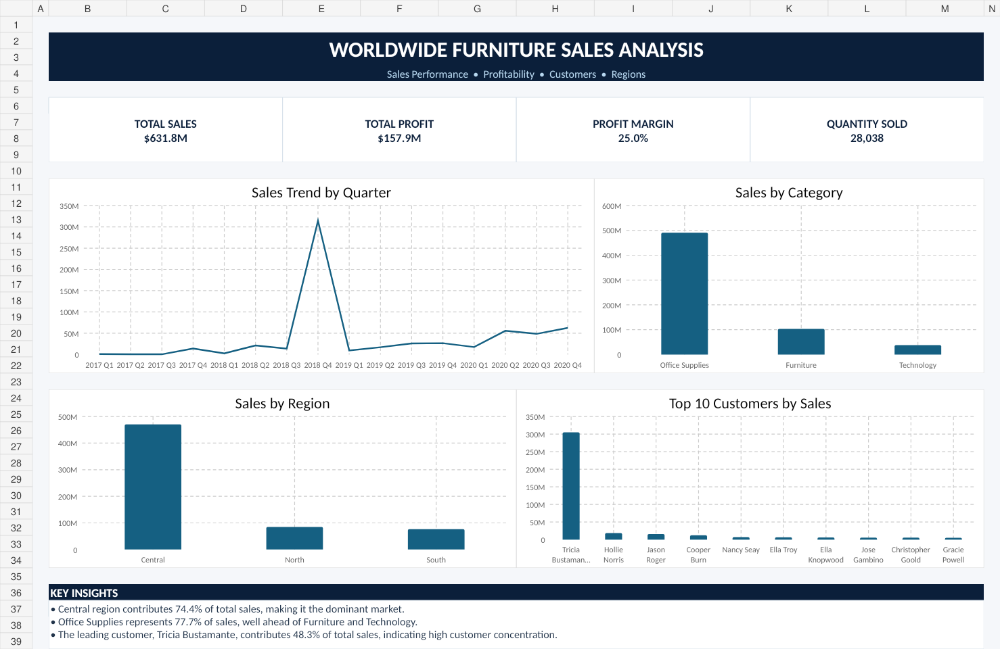

# Worldwide Furniture Sales Analysis

An Excel-based data analytics project focused on analyzing worldwide furniture sales performance across regions, customers, product categories, and profitability.

## Project Overview

The goal of this project was to transform raw sales data into a structured Excel analysis that makes it easier to understand business performance, identify trends, and highlight areas that require attention.

The project includes detailed source data, PivotTable-based analysis, slicers, and an interactive Excel dashboard.

## Business Questions

- How is overall sales performance changing over time?
- Which regions contribute the most to total sales?
- Which product categories generate the highest revenue?
- Who are the highest-value customers?
- How profitable is the business overall?
- Which areas should receive more business attention?

## Dataset

The dataset contains **7,475 sales records** with fields including:

- Order Date
- Shipping Date
- Customer Name
- City
- Country
- State
- Region
- Segment
- Ship Mode
- Category
- Sub-Category
- Product Name
- Sales
- Cost
- Profit
- Quantity
- Aging / Escalation Bucket

## Analysis Performed

The analysis was completed in Microsoft Excel using PivotTables, formulas, charts, and slicers.

Key areas analyzed include:

- Total sales and profitability
- Regional sales performance
- Product category performance
- Customer contribution
- Sales trends over time
- Segment-level performance
- Aging / escalation bucket analysis

## Dashboard Highlights

The dashboard presents the main business KPIs and supporting visuals, including:

- **Total Sales:** $631.8M
- **Total Profit:** $157.9M
- **Profit Margin:** 25.0%
- **Quantity Sold:** 28,038
- Sales trend analysis
- Sales by region
- Sales by category
- Top customers by sales

## Key Insights

- The **Central region contributed approximately 74.4% of total sales**, making it the strongest-performing region.
- **Office Supplies represented approximately 77.7% of total sales**, significantly ahead of Furniture and Technology.
- The highest-value customer, **Tricia Bustamante**, contributed approximately **48.3% of total sales**, showing a high level of customer concentration.
- Overall profit margin was approximately **25%**, indicating strong profitability across the dataset.

## Recommendations

- Monitor customer concentration and reduce dependency on a small number of high-value customers.
- Investigate opportunities to increase sales contribution from the North and South regions.
- Explore growth opportunities in Furniture and Technology to create a more balanced category mix.
- Continue tracking profitability alongside revenue to ensure sales growth remains financially healthy.
- Use the dashboard regularly to monitor shifts in regional, category, and customer performance.

## Tools Used

- Microsoft Excel
- PivotTables
- Excel Formulas
- Charts
- Slicers
- Data Analysis
- Dashboard Design
- Data Visualization

## Project Files

- `WW FURNITURE Dashboard.xlsx` — Excel workbook containing the source data, PivotTables, and dashboard
- `Dashboard.png` — dashboard preview image

## Dashboard Preview

## Skills Demonstrated

**Excel · PivotTables · Data Analysis · KPI Reporting · Data Visualization · Dashboard Development · Business Analysis · Customer Analysis · Sales Analysis**

## Project Goal

The objective of this project was to turn detailed sales data into a clear and interactive Excel reporting solution that helps users quickly understand sales performance, profitability, customer concentration, and regional trends.

